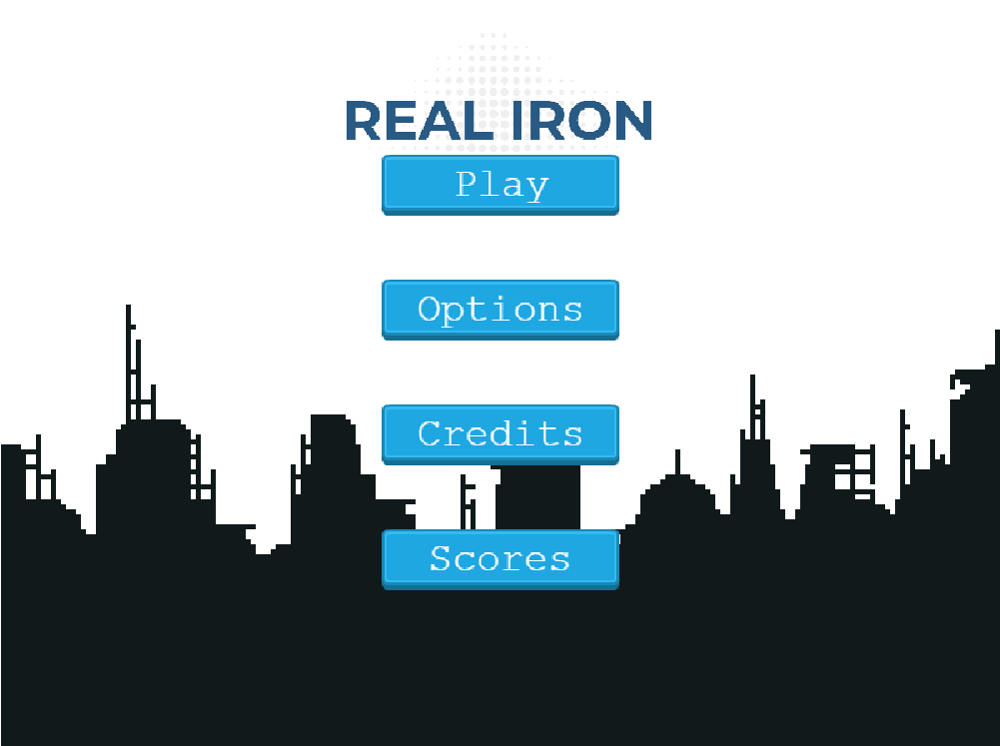
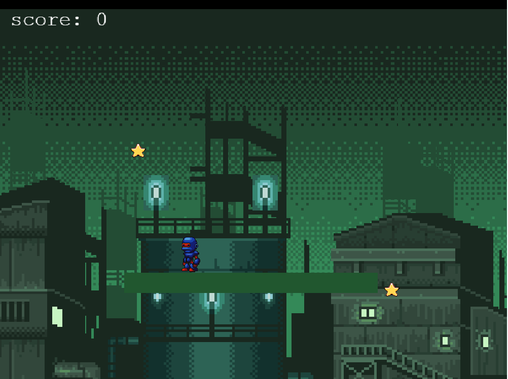
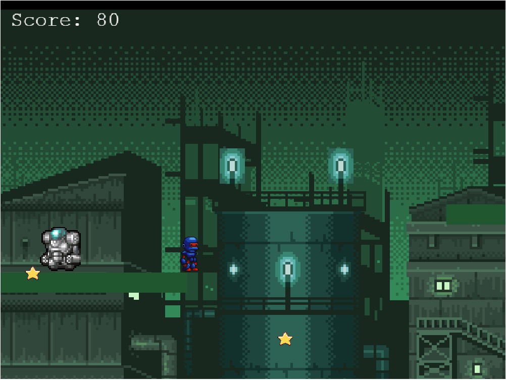
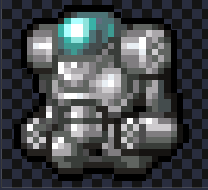

# STAR WARFARE
A JavaScript platform game built with Phaser 3.

## Table of Contents

* [Game Instructions](#game-instructions)
* [Live Demo](#demo)
* [Built With](#built-with)
* [Testing](#testing)
* [Design Credits](#design-credits)
* [Contributing](#contributing)
* [Acknowledgments](#acknowledgments)
* [Author](#author)
* [License](#license)

## Game Instructions

### Prerequisites

- Using NPM package and JavaScript knowledge to build and test the game.

### Installation

- Clone this repository into your own account
- Run npm install to run all of the dependencies into your local repository
- Run the command 'npm start' to start the game running into your local machine.
- Finally, open [http://localhost:3000/](http://localhost:3000/) on your browser.

### Game Concept

In a world taken over by robot boxing there is a small robot called Atom trying to make it in the world of boxing.
On his journey to get stronger he needs to evade the stronger robots and collect as many stars as possible to get to the end of the game.

Do you think you've got what it takes to make Atom the best robot boxer in the world 

### Main Objective

Survive as long as possible and collect as many starts as you can.

### How to play

- To move Atom you should use the 'left' and 'right' arrow keys on your keyboard.
- Jump by pressing the 'up' arrow on your keyboard.
- Collect stars in order to increase your score to become the best robot boxer.
- Avoid all obstacles to keep Atom alive.

#### Atom (The Hero )

- Atom doesn't look like much on the outside but don't let looks deceive you.

#### Enemies

- The road to victory is filled with Guard bot. Avoid them at all cost

#### Stars

- Collect as much stars as possible.

## Demo

[Live Demo](https://real-iron.netlify.app/)

## Game Development Stages

- **Day 1**
**Learn Phaser 3 module**
 I code along the Phaser 3 platform game tutorial learning the basics about how to structure the project. I setup as well the current repo, installing Webpack and Phaser 3, thinking about the game logic. Manage to complete this steps without any problems.

- **Day 2**
**Game Design**
 Pulish the game concept, define the characters and main objective. Look for assets to implement all of the game scenes. Define the game rules and logic. Plan the development of the game in specific chunks of user stories converted to technical tasks to be done. 
  - Game Concept 
  - Characters 
  - Main Objective 
  - Define Game Logic 
  - Implementation Plan 
  - Define Assets 

- **Day 3**
**Scene Development**
  - Implement main menu 
  - Implemente main game 

- **Day 4**
**Game Development**
  - Implement leaderboard menu

- **Day 5**
**Deployment**
  - Run tests (Done)
  - Deploy to netlify (Done)

### Retrospective:

After developing the game and looking back at the initial plan, conceived on the second day these are some reflections about my development.

What went wrong?
Overall, I assume Phaser would be easier. It's documentation is confusing and not cohesive enough. This meant a lot of time was invested in googling how to work around specific things, such as animations and implementing forms. This was not easy at all and very time consuming. The provided examples and tutorial didn't seem enough. 

What went well?
Creating the game itself went really well.. 

## Built With
- Javascript
- HTML
- Phaser 3
- Webpack
- Babel
- Leaderboard API
- JEST testing
- Netlify
- ESlint and Stylelint as linters

## Testing

- Run tests by running: `npm test` on your CL.

## Contributing

Contributions, issues and feature requests are welcome!

You can do it on [issues page](issues/).

## Acknowledgments

Special thanks for inspiration and motivation to Microverse community:
- Team The Manx
- Santiago Rodriguez Bermudez
- Carlos Prieto Barron

## Show your support

Give a ⭐️ if you like this project!

## Author

👤 Michael Threels
- Github: [@mikethreels](https://github.com/mikethreels)
- Twitter: [@MichaelThreels](https://twitter.com/MichaelThreels)
- LinkedIn :[michaelthreels](https://www.linkedin.com/in/michael-threels)

## License

MIT standard license.